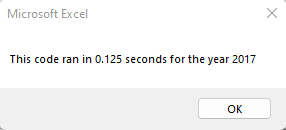

# stock-analysis

## Overview of Project

The purpose of this project overall was to refactor a VBA Module in order to improve the performance of the module. The use of nested for loops, along with conditionals and improved syntax in the module, the overall performance of the Macro was made more efficient, reducing the time it took to run.

## Results

The runtimes for the non refactored code times were 0.12 seconds for 2017 and 0.086 seconds for 2018, as shown below.

{width="159"}

{width="156"}

After refactoring the code, the run times were 0.070 seconds for 2017 and 0.039 seconds for 2018.

{width="207"}

{width="207"}

As you can see the times improved by a significant amount for both years.

## Summary

There are multiple advantages of refactoring a piece of code. For one thing, a refactored script should be more efficient when it is run, meaning it takes less resources from the computer and completes the task faster than before. The other advantage making a piece of code more readable and reproducible. If a script runs well but is convoluted and hard to understand, then it doesn't do anyone any good.
